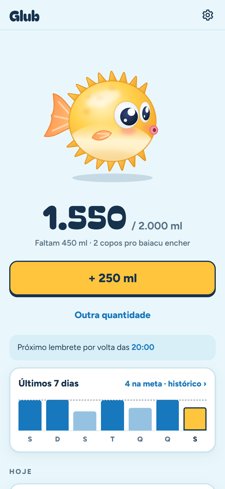
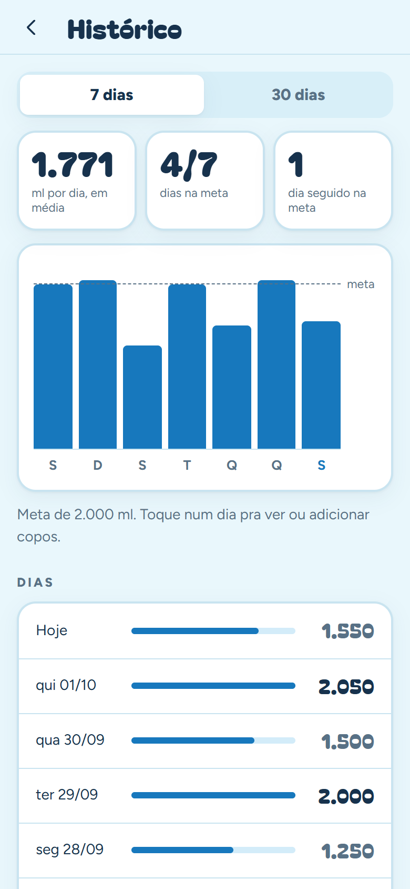
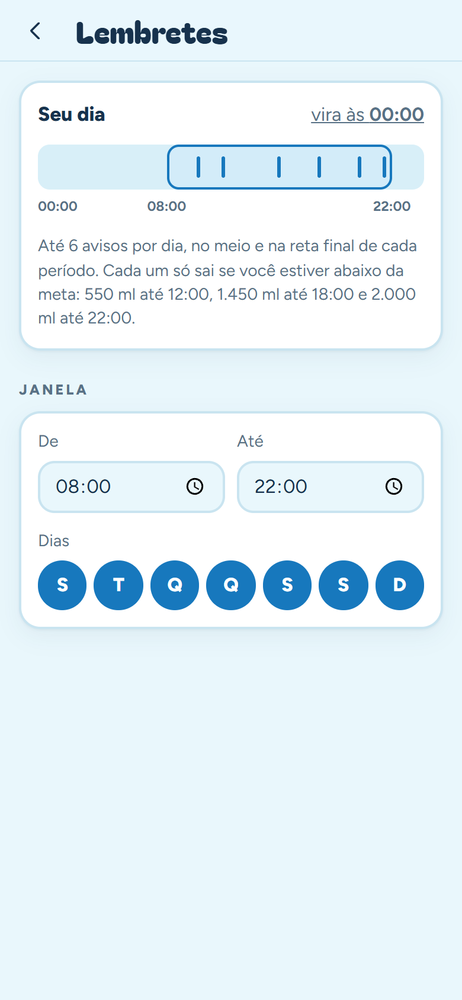
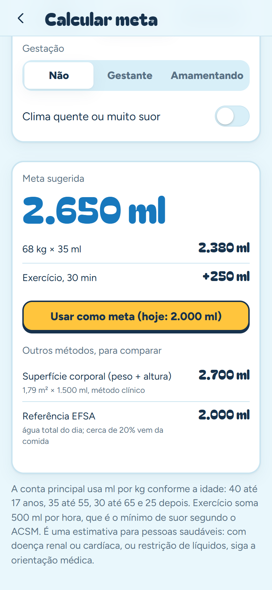

<p align="center">
  
</p>

<h1 align="center">Glub</h1>

<p align="center">
  Lembrete de beber água no iPhone, com um baiacu que infla a cada copo.
</p>

<p align="center">
  <a href="https://github.com/nathanwag/glub/actions/workflows/deploy.yml"></a>
  
  
  
</p>

<table align="center">
  <tr>
    <td align="center">
      <picture>
        <source media="(prefers-color-scheme: dark)" srcset="docs/screenshots/hoje-dark.png">
        
      </picture>
      <br><sub><b>Hoje</b></sub>
    </td>
    <td align="center">
      <picture>
        <source media="(prefers-color-scheme: dark)" srcset="docs/screenshots/historico-dark.png">
        
      </picture>
      <br><sub><b>Histórico</b></sub>
    </td>
    <td align="center">
      <picture>
        <source media="(prefers-color-scheme: dark)" srcset="docs/screenshots/lembretes-dark.png">
        
      </picture>
      <br><sub><b>Lembretes</b></sub>
    </td>
    <td align="center">
      <picture>
        <source media="(prefers-color-scheme: dark)" srcset="docs/screenshots/meta-dark.png">
        
      </picture>
      <br><sub><b>Calcular meta</b></sub>
    </td>
  </tr>
</table>

O Glub é um app web que você instala na Tela de Início do iPhone. Você registra
cada copo com um toque, e o baiacu vai inflando até a meta do dia. Se você
ficar pra trás, chega uma notificação push. Se estiver em dia, ele fica quieto.

## O que ele faz

- **Avisa só quando você está atrasado.** A janela do dia (ex.: 08:00–22:00)
  é dividida em manhã, tarde e noite, e a meta é repartida pelas horas de cada
  período. Cada período pode avisar no meio e 30 min antes do fim, mas só se o
  total do dia estiver abaixo do esperado ali. São no máximo 6 avisos por dia,
  e quem está em dia não recebe nenhum. A notificação diz quanto falta:
  *"Faltam 450 ml até as 18h"*.
- **Tocar na notificação já registra um copo**, porque o iOS não mostra botões
  em web push. O app abre com **Não bebi · adiar 10 min** e **Desfazer**.
- **Tela Hoje:** o baiacu, o botão amarelo do seu copo ou garrafa e
  "Outra quantidade", com atalhos e um campo livre. Mostra também os últimos
  7 dias e os copos de hoje agrupados por período.
- **Histórico** de 7 ou 30 dias, com média, dias na meta, sequência e a opção
  de lançar copos esquecidos em dias passados.
- **Configurável:** meta diária, tamanho do copo (qualquer valor em ml), janela
  de horário, dias da semana e a hora em que o dia vira (ex.: 05:00, pra
  madrugada contar no dia anterior).
- **Calcular minha meta:** estima quanto beber a partir do peso e da idade,
  pela regra de ml por kg das calculadoras brasileiras (40, 35, 30 ou 25 ml
  conforme a faixa). Exercício, calor, gestação ou amamentação, altura e sexo
  refinam a conta e permitem comparar com a superfície corporal e com a
  referência da EFSA.
- **Seus dados ficam no aparelho.** Os copos e o perfil da calculadora ficam
  no IndexedDB do iPhone. O servidor recebe só os ajustes dos lembretes, a
  assinatura de push e o total de hoje.
- **Custo zero:** roda num Cloudflare Worker no plano grátis.

## Como funciona

```mermaid
flowchart LR
  subgraph iPhone
    app["Glub instalado<br/>copos no IndexedDB"]
    sw["sw.js<br/>exibe a notificação"]
  end
  subgraph Cloudflare
    worker["Worker<br/>app + /api"]
    kv[("KV STATE")]
    cron(["cron a cada 5 min"])
  end
  apple["Push da Apple"]

  app -- "PUT /api/sync<br/>ajustes, assinatura, total do dia" --> worker
  worker <--> kv
  cron --> worker
  worker -- "Web Push (VAPID)" --> apple
  apple --> sw
```



O iOS não deixa um app web agendar notificações sozinho. Quem decide a hora é o
Worker, e a regra fica em [`www/js/reminder.js`](www/js/reminder.js). O app
importa esse arquivo pra mostrar o "próximo lembrete", e o Worker importa o
mesmo arquivo pra decidir o envio, então as duas pontas nunca discordam.

O app é JavaScript puro, sem framework e sem etapa de build. O mesmo deploy
publica a interface (`www/`) como static assets do Worker (`worker/`).

## Instalação

O deploy usa uma conta grátis da Cloudflare.

1. **Cloudflare.** Crie uma conta em [dash.cloudflare.com](https://dash.cloudflare.com).
   - Em *My Profile › API Tokens*, crie um token com o template
     **Edit Cloudflare Workers**.
   - Anote também o **Account ID**, que aparece na barra lateral de
     *Workers & Pages*.
2. **Chaves de push (VAPID).** Rode `npx web-push generate-vapid-keys`.
3. **Secrets do GitHub.** No repositório, em *Settings › Secrets and variables ›
   Actions*, cadastre:

   | Secret | Valor |
   |---|---|
   | `CLOUDFLARE_API_TOKEN` | o token do passo 1 |
   | `CLOUDFLARE_ACCOUNT_ID` | o Account ID |
   | `VAPID_PUBLIC_KEY` / `VAPID_PRIVATE_KEY` | as chaves do passo 2 |
   | `VAPID_SUBJECT` | `mailto:seu-email@exemplo.com` |
   | `APP_TOKEN` | uma senha qualquer, que o app vai pedir |

4. **Deploy.** Faça um push na `main` ou rode o workflow **Deploy** na aba
   Actions. No fim do log aparece a URL:
   `https://water-alert.<seu-subdominio>.workers.dev`. O KV `STATE` é criado
   automaticamente no primeiro deploy.
5. **iPhone** (iOS 16.4 ou mais novo):
   1. Abra a URL no **Safari** e toque em **Compartilhar › Adicionar à Tela de
      Início**.
   2. Abra o Glub **pelo ícone**. Push só funciona no app instalado.
   3. Vá em **Ajustes › Servidor** e cole o `APP_TOKEN`.
   4. Volte pra **Ajustes** e ligue a chave **Lembretes**, no topo. Aceite a
      permissão de notificação.
   5. Toque em **Mandar notificação de teste**. Ela deve chegar em segundos.

Os horários ficam em **Ajustes › Quando lembrar**, com uma barra do dia que
mostra a janela e cada aviso possível.

## Desenvolvimento

```bash
npm test             # testes (node --test): regra dos lembretes, contas do dia, textos dos Ajustes, cron, API
npm run dev          # só a interface, com live reload (/phone = moldura de celular)
npm run dev:worker   # app + API + cron em http://localhost:8787 (wrangler dev)
```

O `dev:worker` precisa de um `worker/.dev.vars` (fica fora do git) com
`VAPID_PUBLIC_KEY`, `VAPID_PRIVATE_KEY`, `VAPID_SUBJECT` e `APP_TOKEN`. Para
disparar o cron na mão:
`curl "http://localhost:8787/__scheduled?cron=*/5+*+*+*+*"`.

No Chrome do desktop, o push funciona em `localhost`, então dá pra testar o
fluxo inteiro sem o iPhone. Os logs de produção aparecem em
`npx wrangler tail` (rode dentro de `worker/`).

## Licença

© 2026 Nathan Wagner. Todos os direitos reservados. O código está aberto pra leitura, mas não pode ser copiado, modificado nem usado sem autorização. Veja [LICENSE](LICENSE).
